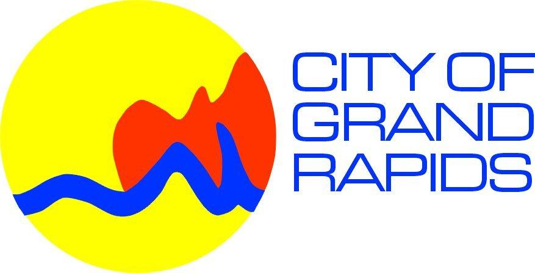
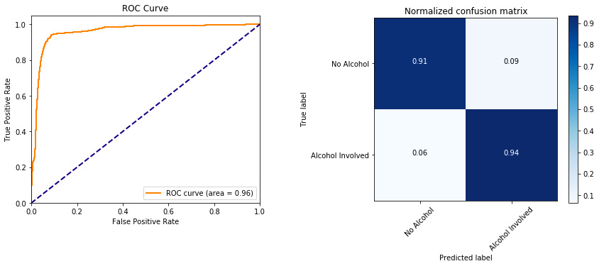

#  Grand Rapids Car Crash Analysis

This repo contains a few notebooks where I processed [Grand Rapids car crash data](http://grdata-grandrapids.opendata.arcgis.com/datasets/cgr-crash-data) (courtesy of GRData), and built a model to predict if a car crash was caused by a drunk driver or not. Overall, I was very pleased with the model's predictions. To give you an idea, here is an ROC curve and confusion matrix indicating the model's prediction accuracy.

---
---

##  Big Data Ignite 2018

In additon, this analysis served as the backbone of my talk, "Machine Learning from Scratch", presented at the [Big Data Ignite Conference 2018](https://bigdataignite.org). The notebook that I presented on at the conference is linked [here](https://github.com/collinprather/BDI-2018-JupyterHub/blob/master/SVM_scratch.ipynb)